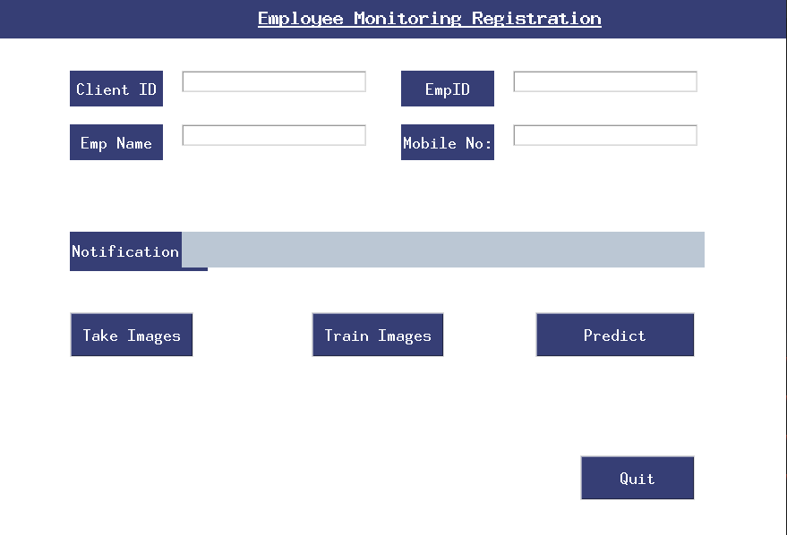

# attendence_system
## Table of Content
  * [Demo](#demo)
  * [Overview](#overview)
  * [Technical Aspect](#technical-aspect)
  * [Installation](#installation)
  * [Technologies Used](#technologies-used)
## Demo
Look of the App

## Overview
This is a simple Face Recognition Attendence System user friendly desktop app.
This app can take images, train and predict the users face on real time. Users only have to click the button, the app automatically do the all things. He does not have to  give images manutally, the app automatically take images after clicking on the Take Image button.  
## Technical Aspect
This project is divided into three parts:
  1. Take images of the unknown persons using MTCNN.
  2. Embedding the images based on FaceNet model using mxnet.
  3. Training a deep learning model using the emdedding of the images.
## Installation
The code is written in python 3.7. To install the required packeges and libraries, run this command in the project directory after [cloning]() the respository:
respository:
```bash
pip install -r requirements.txt
```
For playing the app, just to run this command on the project directory:
```bash
run app.py
```
## Technologies Used


[](https://www.tensorflow.org/)
[](https://keras.io/)

[](https://arthurcaillau.com/mxnet-made-simple-symbol-api/)
